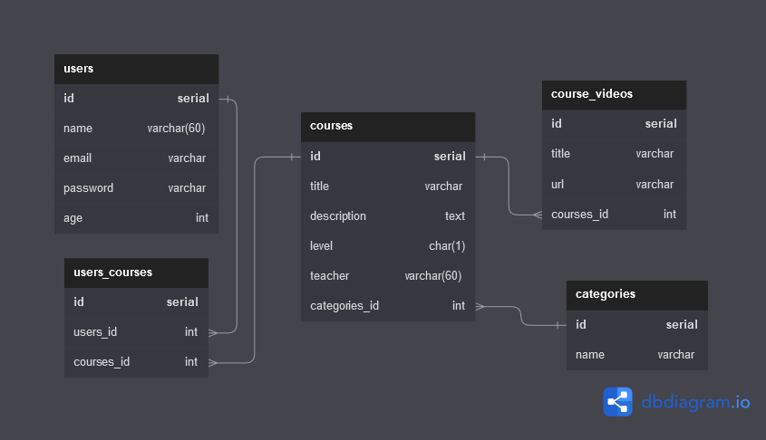

# Database - Courses

This is a small relational database to apply my knowledge about databases and how they communicate each other.
It has four five tables with different relations and each one with their respective constraints.

